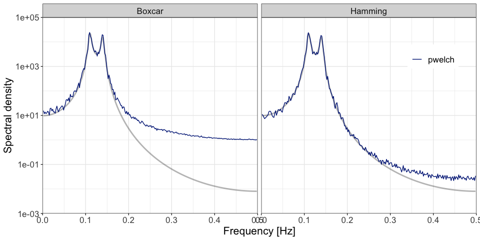

<!-- README.md is generated from README.Rmd. Please edit that file -->

# dwelch

<!-- badges: start -->
<!-- badges: end -->

<tt>dwelch</tt> provides code to calculate the debiased Welch estimator
developed in LINK TO PAPER.

## Installation

You can install the development version of <tt>dwelch</tt> from
[GitHub](https://github.com/) with:

``` r
devtools::install_github("astfalckl/dwelch")
```

## Generate AR(4) Example

We demonstrate the basic functionality of <tt>dwelch</tt> with the
classic AR(4) problem. First, import some basic packages.

``` r
library(dwelch)
library(ggplot2)
library(tidyverse)
```

Next, we set our parameters and generate an AR process.

``` r
m <- 32
l <- 512
s <- ceiling(l / 2)
n <- (m - 1) * s + l
delta <- 1 # sampling interval (not frequency)

phis <- c(2.7607, -3.8106, 2.6535, -0.9238)
sd <- 1
sampled_ar <- stats::arima.sim(list(ar = phis), n, n.start = 1000, sd = sd)
```

Define our data taper, <tt>h</tt>, and calculate Welch’s estimate of the
AR process. We will show results for the boxcar and Hamming tapers
side-by-side. See package
[gsignal](https://cran.r-project.org/web/packages/gsignal/index.html)
for a fairly comprehensive list of other tapers.

``` r
h_hm <- gsignal::hamming(l) # Hamming filter
h_bc <- rep(1, l) #Boxcar filter

pwelch_bc <- dwelch::pwelch(sampled_ar, m, l, s, delta, h_bc)
pwelch_hm <- dwelch::pwelch(sampled_ar, m, l, s, delta, h_hm)

# Plot both pwelch estimates together

pwelch_both <- pwelch_bc %>%
    left_join(pwelch_hm, by = "ff", suffix = c("_Boxcar", "_Hamming")) %>%
    pivot_longer(
        -ff,
        names_to = "filter",
        names_prefix = "pwelch_",
        values_to = "pwelch"
    )

pwelch_both %>%
    mutate(ar = ar_spectrum(pwelch_both$ff, phis, sd, delta)) %>%
    ggplot() +
    geom_line(aes(x = ff, y = ar), linewidth = 1, alpha = 0.3) +
    geom_line(aes(x = ff, y = pwelch, colour = "pwelch")) +
    scale_x_continuous(
        "Frequency [Hz]",
        limits = c(0, 0.5 / delta),
        expand = c(0, 0)
    ) +
    scale_y_continuous(
        "Spectral density",
        limits = c(1e-3, 1e5),
        expand = c(0, 0),
        trans = "log10"
    ) +
    scale_color_manual(values = c("pwelch" = "#002385")) +
    facet_wrap(vars(filter)) +
    theme(
        legend.position = c(0.9, 0.8),
        legend.title = element_blank(),
        text = element_text(size = 16)
    )
```



## Calculated Debiased Welch estimate

For the debiased Welch estimator we must only make one additional
specification: the number of debiased bases, <tt>k</tt>. Aside from
this, the function <tt>dwelch</tt> excutes similarly to <tt>pwelch</tt>,
above.

``` r
k <- round(get_nfreq(l) / 2, 0)

dwelch_bc <- dwelch(sampled_ar, m, l, s, k, delta, h_bc)
dwelch_hm <- dwelch(sampled_ar, m, l, s, k, delta, h_hm)

# Plot both dwelch estimates together

dwelch_both <- dwelch_bc %>%
    left_join(dwelch_hm, by = "ff", suffix = c("_Boxcar", "_Hamming")) %>%
    pivot_longer(
        -ff,
        names_to = "filter",
        names_prefix = "dwelch_",
        values_to = "dwelch"
    )

pwelch_both %>%
    mutate(ar = ar_spectrum(pwelch_both$ff, phis, sd, delta)) %>%
    ggplot() +
    geom_line(aes(x = ff, y = ar), linewidth = 1, alpha = 0.3) +
    geom_line(aes(x = ff, y = pwelch, colour = "pwelch")) +
    geom_line(
        data = dwelch_both,
        mapping = aes(x = ff, y = dwelch, colour = "dwelch")
    ) +
    scale_x_continuous(
        "Frequency [Hz]",
        limits = c(0, 0.5 / delta),
        expand = c(0, 0)
    ) +
    scale_y_continuous(
        "Spectral density",
        limits = c(1e-3, 1e5),
        expand = c(0, 0),
        trans = "log10"
    ) +
    scale_color_manual(
        values = c("pwelch" = "#002385", "dwelch" = "#8d3b00")
    ) +
    facet_wrap(vars(filter)) +
    theme(
        legend.position = c(0.9, 0.8),
        legend.title = element_blank(),
        text = element_text(size = 16)
    )
```


