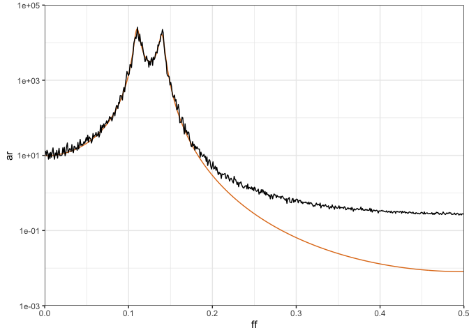

<!-- README.md is generated from README.Rmd. Please edit that file -->

# dwelch

<!-- badges: start -->
<!-- badges: end -->

<tt> dwelch </tt> provides code to calculate the debiased Welch
estimator developed in LINK.

## Installation

You can install the development version of <tt> dwelch </tt> from
[GitHub](https://github.com/) with:

``` r
devtools::install_github("astfalckl/dwelch")
```

## AR(4) Example

We demonstrate the basic functionality of <tt> dwelch </tt> with the
classic AR(4) problem.

``` r
library(dwelch)
library(ggplot2)
library(tidyverse)
#> ── Attaching core tidyverse packages ──────────────────────── tidyverse 2.0.0 ──
#> ✔ dplyr     1.1.2     ✔ readr     2.1.4
#> ✔ forcats   1.0.0     ✔ stringr   1.5.0
#> ✔ lubridate 1.9.2     ✔ tibble    3.2.1
#> ✔ purrr     1.0.1     ✔ tidyr     1.3.0
#> ── Conflicts ────────────────────────────────────────── tidyverse_conflicts() ──
#> ✖ dplyr::filter() masks stats::filter()
#> ✖ dplyr::lag()    masks stats::lag()
#> ℹ Use the conflicted package (<http://conflicted.r-lib.org/>) to force all conflicts to become errors
library(gsignal)
#> 
#> Attaching package: 'gsignal'
#> 
#> The following object is masked from 'package:lubridate':
#> 
#>     dst
#> 
#> The following object is masked from 'package:dplyr':
#> 
#>     filter
#> 
#> The following object is masked from 'package:dwelch':
#> 
#>     pwelch
#> 
#> The following objects are masked from 'package:stats':
#> 
#>     filter, gaussian, poly

theme_set(theme_bw())

m <- 34
l <- 1111
s <- ceiling(l / 2)
n <- (m - 1) * s + l

phis <- c(2.7607, -3.8106, 2.6535, -0.9238)
sd <- 1
sampled_ar <- stats::arima.sim(list(ar = phis), n, n.start = 1000)

h <- rep(1, l)

welch_estimate <- dwelch::pwelch(sampled_ar, m, l, s, window = h)

welch_estimate %>%
    mutate(ar = ar_spectrum(welch_estimate$ff, phis, sd)) %>%
    ggplot() +
        geom_line(aes(x = ff, y = ar), colour = "#e17c1d") +
        geom_line(aes(x = ff, y = welch)) +
        scale_x_continuous(
            limits = c(0, 0.5),
            expand = c(0, 0)
        ) +
        scale_y_continuous(
            limits = c(1e-3, 1e5),
            expand = c(0, 0),
            trans = "log10"
        )
```


