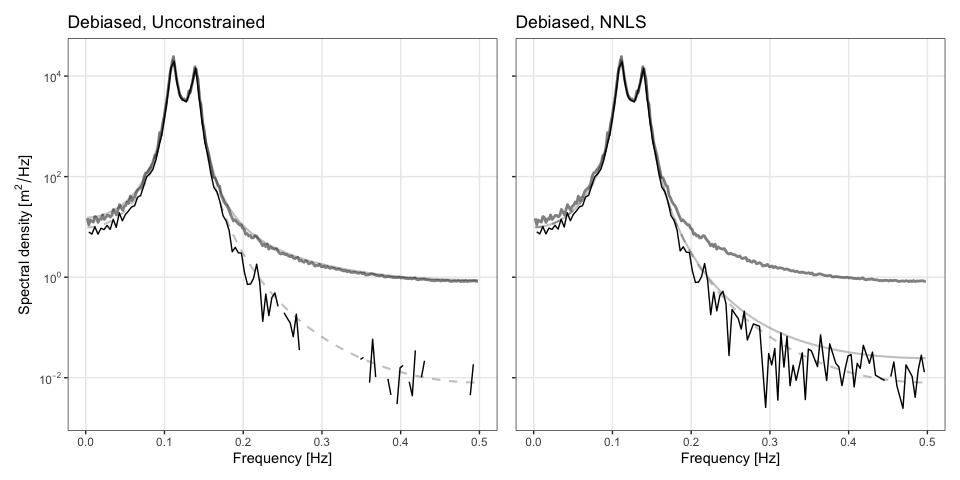

<!-- README.md is generated from README.Rmd. Please edit that file -->

# dwelch

<!-- badges: start -->
<!-- badges: end -->

<tt>dwelch</tt> provides code to calculate the debiased Welch estimator
developed [here](https://arxiv.org/pdf/2312.13643.pdf). Code for routine
data manipulation and plotting is hidden; if you are interested in this
consult <tt>README.Rmd</tt>. <tt>python</tt> implementation of the code
is part of the larger <tt>speccy</tt> package available
[here](https://github.com/TIDE-ITRH/speccy).

## Installation

You can install the development version of <tt>dwelch</tt> from
[GitHub](https://github.com) with:

``` r
devtools::install_github("astfalckl/dwelch")
```

## Generate AR(4) Example

We demonstrate the basic functionality of <tt>dwelch</tt> with the
classic AR(4) problem. First, import some basic packages.

``` r
library(dwelch)
library(ggplot2)
library(tidyverse)
library(latex2exp)
library(patchwork)
library(SuperGauss)
```

Next, we set our parameters and generate an AR process.

``` r
m <- 2^6
l <- 2^9
overlap <- 0
s <- l * (1 - overlap)
n <- (m - 1) * s + l
delta <- 1

phis <- c(2.7607, -3.8106, 2.6535, -0.9238)
sd <- 1

sampled_ar <- stats::arima.sim(
    list(ar = phis), n, n.start = 1000, sd = sd
)
```

Define our data taper, <tt>h</tt>, and calculate Welch’s estimate of the
AR process. We will show results for the boxcar and Hamming tapers
side-by-side. See package
[gsignal](https://cran.r-project.org/web/packages/gsignal/index.html)
for a fairly comprehensive list of other tapers. Note, gsignal masks the
function <tt>pwelch</tt> and so if gsignal is loaded into your R session
you will need to explicitly call <tt>dwelch::pwelch</tt>.

``` r
h_hm <- gsignal::hamming(l) # Hamming filter
h_bc <- rep(1, l) #Boxcar filter

pwelch_bc <- dwelch::pwelch(sampled_ar, m, l, s, delta, h_bc)
pwelch_hm <- dwelch::pwelch(sampled_ar, m, l, s, delta, h_hm)
```

    #> Warning: Using `size` aesthetic for lines was deprecated in ggplot2 3.4.0.
    #> ℹ Please use `linewidth` instead.
    #> This warning is displayed once every 8 hours.
    #> Call `lifecycle::last_lifecycle_warnings()` to see where this warning was
    #> generated.


## Calculate debiased Welch estimate

For the debiased Welch estimator we must only make one additional
specification: the number of debiased bases, <tt>k</tt>. Aside from the
selection of <tt>k</tt>, the function <tt>dwelch</tt> excutes similarly
to <tt>pwelch</tt>, above.

``` r
dwelch_bc <- dwelch::dwelch(sampled_ar, m, l, s, k = l / 4, h = h_bc)
dwelch_hm <- dwelch::dwelch(sampled_ar, m, l, s, k = l / 4, h = h_hm)
```

    #> Warning: Removed 1 row containing missing values (`geom_line()`).


## Non-negative solutions

The WLS solution does not constain the debiased estimator to
non-negative solutions, which is required of a spectral estimator with
positive definite ACF. Note, this happens when the signal at a frequency
is masked by spectral leakage. <tt>dwelch</tt> has functionality to
constrain solutions to be non-negative, this is done by setting
<tt>model = “nnls”</tt>. See the example below where we have selected an
example with a particularly bad solution space. Note, non-positive
values are not plotted.

``` r
set.seed(45)

sampled_ar <- stats::arima.sim(
    list(ar = phis), n, n.start = 1000, sd = sd
)

pwelch_bc <- dwelch::pwelch(sampled_ar, m, l, s, h = h_bc)
dwelch_bc <- dwelch::dwelch(sampled_ar, m, l, s, k = l / 4, h = h_bc)
dwelch_nnls <- dwelch::dwelch(sampled_ar, m, l, s, k = l / 4, h = h_bc, model = "nnls")
```



## Equivalence to Welch’s estimate

In circumstances where there is no, or little, bias present in the
result, <tt>dwelch</tt> converges to the pwelch estimate. For the AR(4)
model above, a Hann taper removes almost all of the broadband blurring
(this is discussed further in Percival and Walden). We would then expect
the dwelch and pwelch estimates to be the same. We show this below,
noting that as $m$ increases, and hence the validity of certain
assumptions in the paper increase, the estimates converge.

``` r
k <- round(get_nfreq(l), 0)

m1 <- 32
m2 <- 128
n1 <- (m1 - 1) * s + l
n2 <- (m2 - 1) * s + l

h_hn <- gsignal::hann(l) # Hann filter

sampled_ar1 <- stats::arima.sim(list(ar = phis), n1, n.start = 1000, sd = sd)
sampled_ar2 <- stats::arima.sim(list(ar = phis), n2, n.start = 1000, sd = sd)

pwelch_hn1 <- dwelch::pwelch(sampled_ar1, m1, l, s, delta, h_hn)
dwelch_hn1 <- dwelch::dwelch(sampled_ar1, m1, l, s, k, delta, h_hn)
pwelch_hn2 <- dwelch::pwelch(sampled_ar2, m2, l, s, delta, h_hn)
dwelch_hn2 <- dwelch::dwelch(sampled_ar2, m2, l, s, k, delta, h_hn)
```


## Uneven Bases

We can specify uneven bases for <tt>dwelch</tt> by instead providing
either the centres and widths, or the lower and upper bounds of the
bases. We demonstrate this functionality by replicating the Section 6
results from the paper. Herem, we calculate lower and upper bounds, and
specify our bases as approximately linear in the log-space (the first
couple of bases instead align with the natural Fourier frequencies so as
to not lead to an undefined system).

``` r
n_sample <- 2^15
m <- 32
l <- n_sample / m

alpha <- 5 / 6 + 1
lambda <- 0.1
delta <- 1

ff <- seq(1, l - 1) / l / delta
ff <- ff[ff < (0.5 * 1 / delta)]

acf <- matern_acf(delta * 0:(n_sample - 1), 1, alpha, lambda)
psd <- matern_psd(ff, 1, alpha, lambda)

sample <- cholZX(rnorm(n_sample), acf)

h <- rep(1, l)

n <- 20
scale <- 0.0023

linear_centres <- get_centres(l, n)$centres
log_centres <- seq(log10(ff[1] + scale), log10(max(linear_centres + scale)), length = n)
log_centres <- log_centres
log_width <- diff(log_centres)[1]
log_lowers <- log_centres - log_width / 2
log_uppers <- log_centres + log_width / 2
lowers <- 10^(log_lowers) - scale
uppers <- 10^(log_uppers) - scale

pwelch_sample <- dwelch::pwelch(sample, m, l, l, delta, h)
dwelch_sample <- dwelch::dwelch(
    sample, m, l, l, delta = delta, h = h,
    model = "nnls", lowers = lowers, uppers = uppers
)
```


