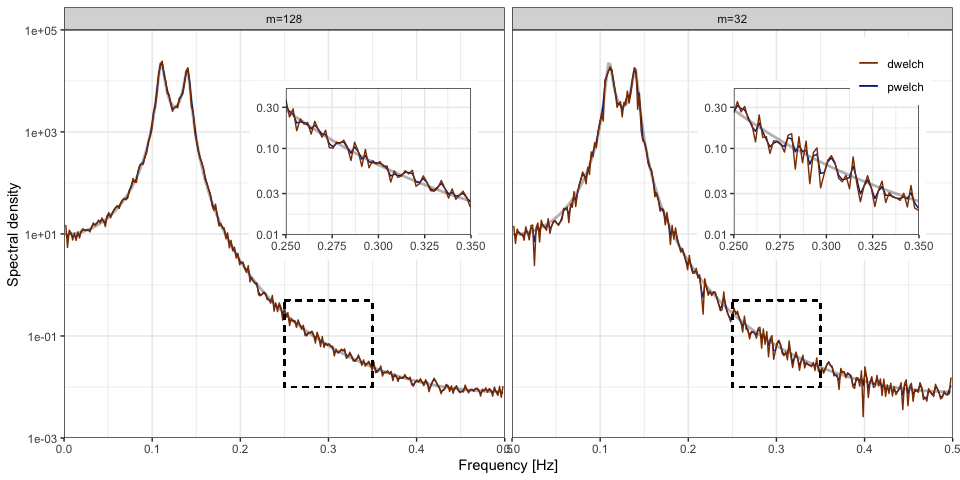

<!-- README.md is generated from README.Rmd. Please edit that file -->

# dwelch

<!-- badges: start -->
<!-- badges: end -->

<tt>dwelch</tt> provides code to calculate the debiased Welch estimator
developed in LINK TO PAPER. Code for routine data manipulation and
plotting is hidden; if you are interested in this consult
<tt>README.Rmd</tt>.

## Installation

You can install the development version of <tt>dwelch</tt> from
[GitHub](https://github.com/) with:

``` r
devtools::install_github("astfalckl/dwelch")
```

## Generate AR(4) Example

We demonstrate the basic functionality of <tt>dwelch</tt> with the
classic AR(4) problem. First, import some basic packages.

``` r
library(dwelch)
library(ggplot2)
library(tidyverse)
```

Next, we set our parameters and generate an AR process.

``` r
m <- 32
l <- 512
s <- ceiling(l / 2)
n <- (m - 1) * s + l
delta <- 1 # sampling interval (not frequency)

phis <- c(2.7607, -3.8106, 2.6535, -0.9238)
sd <- 1
sampled_ar <- stats::arima.sim(list(ar = phis), n, n.start = 1000, sd = sd)
```

Define our data taper, <tt>h</tt>, and calculate Welch’s estimate of the
AR process. We will show results for the boxcar and Hamming tapers
side-by-side. See package
[gsignal](https://cran.r-project.org/web/packages/gsignal/index.html)
for a fairly comprehensive list of other tapers. Note, gsignal masks the
function <tt>pwelch</tt> and so if gsignal is loaded into your R session
you will need to explicitly call <tt>dwelch::pwelch</tt>.

``` r
h_hm <- gsignal::hamming(l) # Hamming filter
h_bc <- rep(1, l) #Boxcar filter

pwelch_bc <- pwelch(sampled_ar, m, l, s, delta, h_bc)
pwelch_hm <- pwelch(sampled_ar, m, l, s, delta, h_hm)
```


## Calculate debiased Welch estimate

For the debiased Welch estimator we must only make one additional
specification: the number of debiased bases, <tt>k</tt>. Aside from the
selection of <tt>k</tt>, the function <tt>dwelch</tt> excutes similarly
to <tt>pwelch</tt>, above.

``` r
k <- round(get_nfreq(l) / 2, 0)

dwelch_bc <- dwelch(sampled_ar, m, l, s, k, delta, h_bc)
dwelch_hm <- dwelch(sampled_ar, m, l, s, k, delta, h_hm)
```


## Non-negative solutions

The WLS solution does not constain the debiased estimator to
non-negative solutions, which is required of a spectral estimator. Note,
this happens when the signal at a frequency is masked by spectral
leakage. <tt>dwelch</tt> has functionality to constrain solutions to be
non-negative, this is done by setting <tt>model = “nnls”</tt>. See the
example below where we have selected an example with a particularly bad
solution space. Note, non-positive values are not plotted. Note that for
the Hamming tapered data where the solution is already non-negative, the
nnls solution is the same.

``` r
set.seed(23)

sampled_ar <- stats::arima.sim(list(ar = phis), n, n.start = 1000, sd = sd)

pwelch_bc <- dwelch::pwelch(sampled_ar, m, l, s, delta, h_bc)
pwelch_hm <- dwelch::pwelch(sampled_ar, m, l, s, delta, h_hm)

dwelch_bc <- dwelch(sampled_ar, m, l, s, k, delta, h_bc)
dwelch_hm <- dwelch(sampled_ar, m, l, s, k, delta, h_hm)

nnls_bc <- dwelch(sampled_ar, m, l, s, k, delta, h_bc, model = "nnls")
nnls_hm <- dwelch(sampled_ar, m, l, s, k, delta, h_hm, model = "nnls")
```


## Convergence to Welch’s estimate

``` r
set.seed(28)

k <- round(get_nfreq(l), 0)

m1 <- 16
m2 <- 64
n1 <- (m1 - 1) * s + l
n2 <- (m2 - 1) * s + l

h_hn <- gsignal::hann(l) # Hann filter

sampled_ar1 <- stats::arima.sim(list(ar = phis), n1, n.start = 1000, sd = sd)
sampled_ar2 <- stats::arima.sim(list(ar = phis), n2, n.start = 1000, sd = sd)

pwelch_hn1 <- dwelch::pwelch(sampled_ar1, m1, l, s, delta, h_hn)
dwelch_hn1 <- dwelch::dwelch(sampled_ar1, m1, l, s, k, delta, h_hn)
pwelch_hn2 <- dwelch::pwelch(sampled_ar2, m2, l, s, delta, h_hn)
dwelch_hn2 <- dwelch::dwelch(sampled_ar2, m2, l, s, k, delta, h_hn)
```


